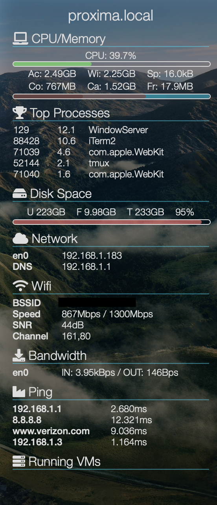

# Sysinfo widget for Übersicht

This widget creates a sidebar on the screen containing lots of system
information in an easy to view fashion.

## Screenshot

## Installation

Copy `sysinfo.jsx` to your übersicht widget directory (`~/Library/Application Support/Übersicht/widgets`) and edit the config section at the top as necessary (e.g. to change the ping hosts). You can also change the list of modules at the bottom of the file.
